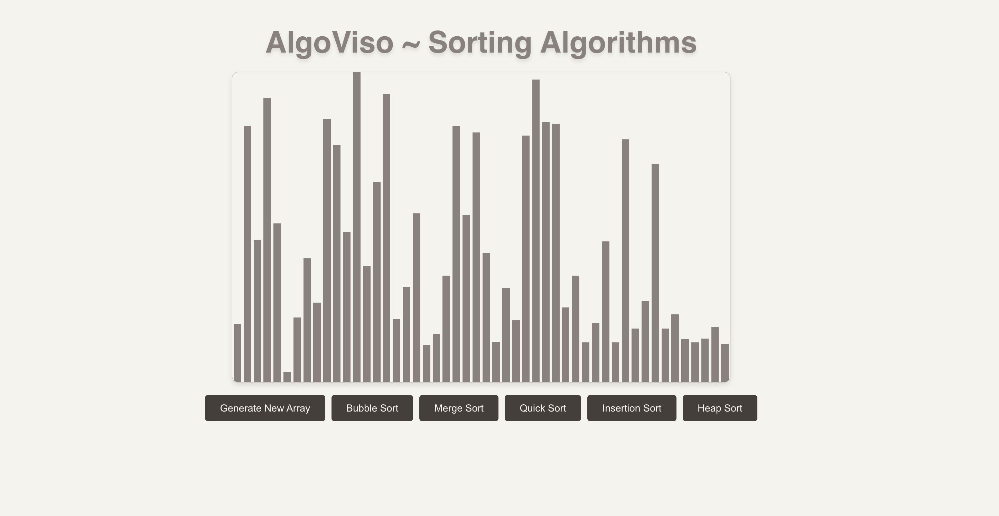

# AlgoViso 📊🤖

Curious about how sorting algorithms really work? Dive into AlgoViso, your ultimate web application for visualizing and mastering sorting techniques. With interactive bar charts and real-time feedback, AlgoViso transforms complex algorithms into an engaging and educational experience. Explore how data is sorted step-by-step and enhance your understanding of algorithmic thinking!

## Screenshot



## Features
- Interactive Visualization: Watch sorting algorithms come to life with dynamic bar charts.
- Comprehensive Algorithm Suite: Explore popular sorting techniques including Bubble, Merge, Quick, Insertion, and Heap Sort.
- Detailed Descriptions: Gain insights into each algorithm's time complexity and operational mechanics.

## Getting Started
Follow these simple steps to set up AlgoViso on your local machine:

1. **Clone the Repository**
   
   ```bash
   git clone https://github.com/your-username/AlgoViso.git
2. Navigate to the Project Directory
   
   ```bash
   cd AlgoVisor
3. Install Dependencies
   ```bash
   npm install
   
4. Start the Development Server
   ```bash
   npm start
